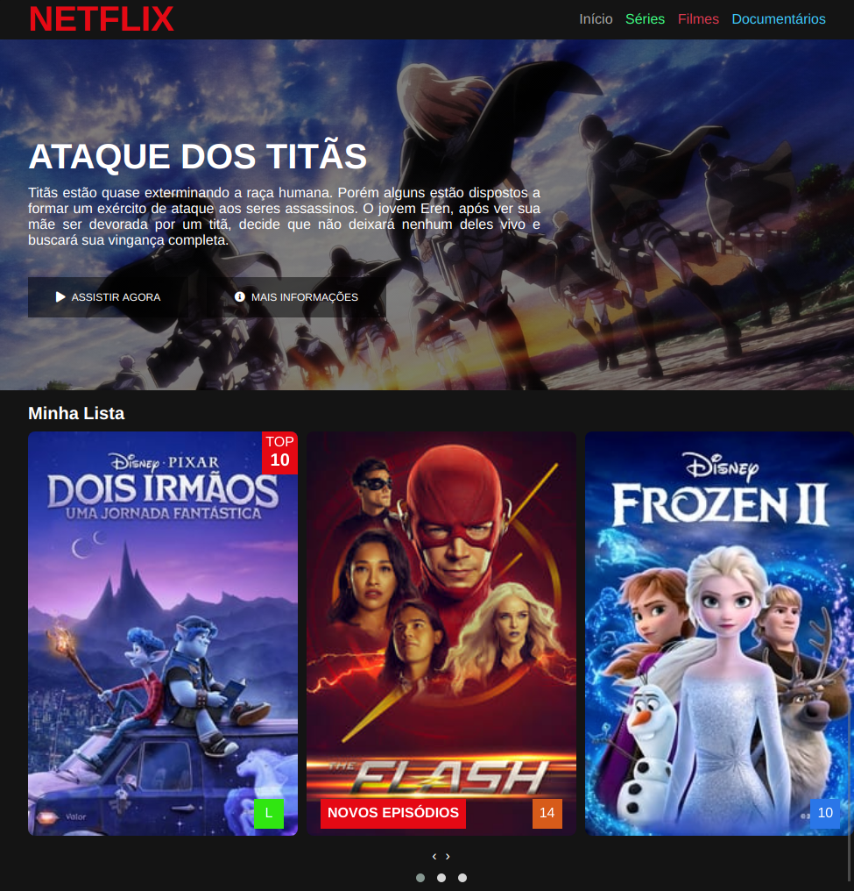
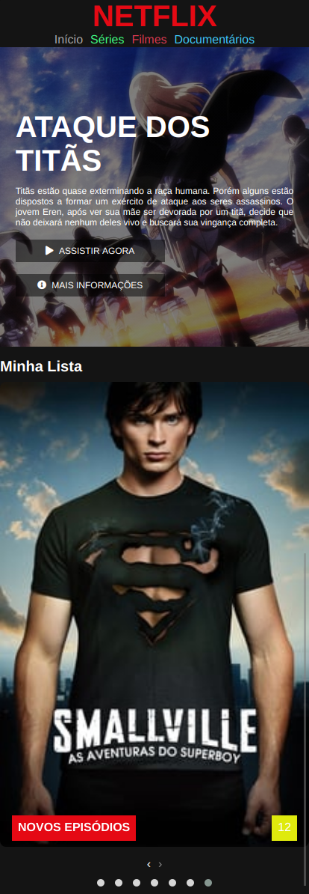

# Clone Netflix

## 🎦 Sobre o projeto

Durante o bootcamp **HTML Web Developer** da [Digital Innovation One](https://github.com/digitalinnovationone) tive a oportunidade de como fazer um clone do famoso serviços de stream de vídeo Netflix graças ao professor [Felipe Aguiar](https://www.linkedin.com/in/felipe-aguiar-047/).

Imagens dos títulos do entretenimento foram retiradas do [The Movie Database](https://www.themoviedb.org/?language=pt-BR).

Para acessar este projeto através do Github Pages, [clique aqui](https://vitorsemidio-dev.github.io/DIO-clone-Netflix/).

## 📺 Imagens

  
  

## 📬 Encontre-me

